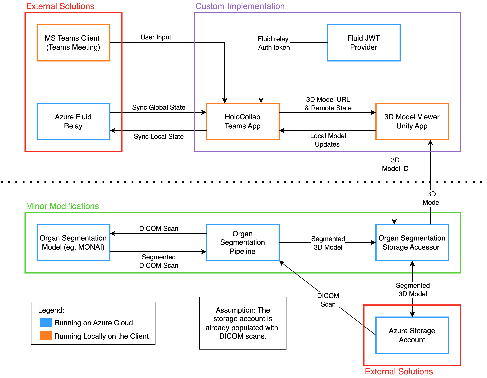

HoloCollab is a software aimed at professionals with the primary goals of facilitating remote collaboration and enabling advanced insights through the use of interactive 2D and 3D resources.
The primary use cases focus on supporting multidisciplinary teams (MDT), merging the functionalities of multiple apps into a single cohesive environment.
Concretely, this resulted in a Microsoft Teams app that provides multiple whiteboards where meeting participants can collaboratively annotate and place additional resources like images, PDFs, text notes, and 3D models.
All interactions are synchronized across clients using Azure Fluid containers and the LiveShare SDK, and each member is served with the same shared app state rendered using React and Fluent UI elements.
Additionally, leveraging previous UCL projects under the HoloRepository umbrella, as well as state-of-the-art machine learning models from MONAI, we provided an avenue tailored to the needs of medical professionals to produce organ-segment 3D models from raw DICOM scans.
The models can then be imported into the collaborative environment, which provides a globally synchronized view of the 3D volumes handling rotation, scaling, and drawing on the model’s texture.

# Showcase 
Demonstration videos

HoloCollab provides the following functionalities:
* Shared collaborative canvas
* Mark up tools for annotation on the canvas:
  * Pen of varying colours and thickness
  * Highlighter of varying colours and thickness
  * Point eraser to delete parts of a stroke
  * Solid eraser to delete entire strokes
  * Laser pointer to highlight parts of the canvas
* Display of 3D models on the canvas, with the following collaborative features:
  * Direct drawing on the model's surface
  * Free rotation and scaling
  * Waypoints to save snapshots of a model's positioning
  * Export the current view of the model to an image
* Sharing of images and PDFs to the canvas using a direct public URL
* Sharing of collaborative text notes for comments and discussion
* Manipulation of 2D and 3D resources shared on the canvas:
  * Moving and resizing
  * Arranging of the z-order
  * Deletion
* Exporting the canvas in its entirety to an image

# Architecture

The HoloCollab system consists of multiple sub-components and remains open to future extensions. Currently, core components are:

### [HoloCollab Teams App](https://github.com/Holo-Repository/MSTeams-WebApp)

The HoloCollab Teams App serves as the system's core, working directly with the MS Teams Client to collect user input and display the app's current state. It not only hosts the 3D Model Viewer Unity App but also coordinates communication between various components through a custom interface. Alongside this, it uses Azure Fluid Relay for real-time state synchronization across all client instances, which also handles user authentication through the Fluid JWT Provider service.

### [3D Model Viewer Unity App](https://github.com/Holo-Repository/Unity3D-ModelViewer)

The 3D Model Viewer Unity App allows users to retrieve models via directly accessible URLs, and do basic manipulations and annotation on models. This component communicates with both the HoloCollab Teams App for display and the Organ Segmentation Storage Accessor for data retrieval.

### [Organ Segmentation Pipeline](https://github.com/Holo-Repository/OrganSegmentation-Pipeline)
The Organ Segmentation Pipeline is the backbone for 3D model creation, working in conjunction with MONAI and Organ segmentation Storage Accessor to create segmented 3D models from DICOM scans. It was originally a part of the HoloRepository but was later modified to handle the computational demands of MONAI.

### [Organ Segmentation Storage Accessor](https://github.com/Holo-Repository/OrganSegmentation-StorageAccessor)
Serving as an intermediary between storage and retrieval, the Organ Segmentation Storage Accessor is responsible for fetching the segmented 3D models from the Azure storage accoun. This makes it easier for other components to interact with storage without diving deep into the specifics of the storage architecture.

### [Organ Segmentation Model](https://github.com/Holo-Repository/OrganSegmentation-Model#run-docker-and-connect-docker-to-the-port-5000)
The Organ Segmentation Model is powered by MONAI and is deployed as part of a Flask webapp on Azure. It uses a neural network to perform segmentation on abdominal CT scans. The model processes the input it receives from the pipeline webapp and sends the segmented results back for further utilization.

# Installation

## Requirements
- [Azure subscription](https://azure.microsoft.com/en-gb/free/search/?ef_id=_k_CjwKCAjw6eWnBhAKEiwADpnw9qYnFEMvOrDxSyZF5UnHZIVys4HMk3WQT-LbHYKpa1cHsZJnjn0rQRoCEGAQAvD_BwE_k_&OCID=AIDcmmiouhop3i_SEM__k_CjwKCAjw6eWnBhAKEiwADpnw9qYnFEMvOrDxSyZF5UnHZIVys4HMk3WQT-LbHYKpa1cHsZJnjn0rQRoCEGAQAvD_BwE_k_&gad=1&gclid=CjwKCAjw6eWnBhAKEiwADpnw9qYnFEMvOrDxSyZF5UnHZIVys4HMk3WQT-LbHYKpa1cHsZJnjn0rQRoCEGAQAvD_BwE)
- [Teams organization](https://learn.microsoft.com/en-us/microsoftteams/platform/concepts/deploy-and-publish/apps-upload)
- [Unity license](https://docs.unity3d.com/Manual/ManualActivationGuide.html)

## Unity
Detailed installation instructions for the Unity ModelViewer can be found [here](https://github.com/Holo-Repository/Unity3D-ModelViewer#readme). 

## HoloRepository
### Provisioning
HoloRepository2023 requires the following Azure resources:
- 1 Storage account
- 1	Container registry
- 1 App Service each for OrganSegmentation-Model, OrganSegmentation-Pipeline, and OrganSegmentation-StorageAccessor
- 1 Health Data Services workspace and 1 FHIR service 

The functionality implemented by HoloCollab does not require FHIR; however it is still kept for compatibility reasons, and future iteration should remove all FHIR related functionality from HoloRepository unless needed.

The `.env` file in [OrganSegmentation-StorageAccessor](https://github.com/Holo-Repository/OrganSegmentation-StorageAccessor) and `config.py` in [OrganSegmentation-Pipeline](https://github.com/Holo-Repository/OrganSegmentation-Pipeline) need to be updated to include the specific details of the provisioned resources.

### Deployment

#### Manual Deployment (Not Recommended)
Build the docker images of all components on your local machine, and follow the [microsoft guide](https://learn.microsoft.com/en-us/azure/container-registry/container-registry-get-started-docker-cli?tabs=azure-cli) to upload the images to the created Container registry, then the in App Services select the uploaded Docker images.

#### Automated Deployment (Recommended):
The automated deployment relies on an Azure DevOps pipeline to build and upload the docker images to the container registry.
To set up the pipeline repeat the following instructions for each of the three components ([OrganSegmentation-Pipeline](https://github.com/Holo-Repository/OrganSegmentation-Pipeline), [OrganSegmentation-Model](https://github.com/Holo-Repository/OrganSegmentation-Model), and [OrganSegmentation-StorageAccessor](https://github.com/Holo-Repository/OrganSegmentation-StorageAccessor)):
- Connect to [Azure DevOps](https://azure.microsoft.com/en-gb/products/devops) through GitHub.
- On DevOps create a new empty pipeline and select the repository of the component.
- Press `Build and push an image to Azure Container Registry` and in the prompt select the Azure subscription and Container registry created previously.
- Either remove the existing `azure-pipelines.yml` and let DevOps generate a new one or select the existing version and modify it according to your configuration.
- Run the pipeline and wait for it to finish.
- After it finishes building, go to the App Services of the component and under `Deployment Center` setup the `Registry` and `Image` fields to point to the container registry and image created by the pipeline.

## HoloCollab
Most of the installation of HoloCollab is handled by the [Teams Toolkit](https://learn.microsoft.com/en-us/microsoftteams/platform/toolkit/teams-toolkit-fundamentals?pivots=visual-studio-code-v5).
It consists 3 main steps: provisioning, deployment, and publishing.
Provisioning and deployment initialize and load the app onto Azure, while publishing makes it available to users.

### Provisioning
All the Azure resources needed by HoloCollab can be provisioned by pressing the `Provision` button in the `Teams Toolkit` tab of Visual Studio Code.
This will create the following resources:
- 1 Storage Account
- 1 Fluid Relay service
- 1 Function App
- 1 App Service

The resources are provisioned according to the configuration in the [BICEP file](./infra/azure.bicep).

Most of the settings are automatically configured by `Teams Toolkit`, however, final steps need to be completed manually:
- CORS should be enabled for the table service of the storage account. For testing purposes we recommend allowing all origins, however, for production, it is recommended to restrict the origins to the domain of the app, which can be found in the `.env` file.
- A shared access signature (SAS) token needs to be generated for the storage account and added to the `.env` file.

### Deployment
Once provisioned, the app can be deployed by pressing the `Deploy` button in the `Teams Toolkit` tab of Visual Studio Code and selecting the appropriate subscription and resource group.

However, the FluidJWTProvider needs to be deployed manually following the instructions in the [FluidJWTProvider repository](https://github.com/Holo-Repository/Azure-Token-Services).

### Publishing
Finally, the app can be published by pressing the `Publish` button in the `Teams Toolkit` tab of Visual Studio Code.
The app will be published in the organization used to login in the Teams Toolkit and will be available for review in the [Teams Admin Center](https://admin.teams.microsoft.com/policies/manage-apps).

# Maintenance
As part of routine maintenance, the following tasks should also be performed:
- Regenerate the access keys of the Fluid Relay and update the `FluidRelayKey` variable in the configuration of the Function App.
- Regenerate the SAS token of the HoloCollab storage account, update it in the `.env` file, and redeploy the app. Note that if not manually updated, the SAS will expire after a set period of time.
- Remove unused Fluid containers following the official [documentation](https://learn.microsoft.com/en-us/azure/azure-fluid-relay/how-tos/container-deletion).

# Team Members
| Name                  | Email                                |
|-----------------------|--------------------------------------|
|Shalini Sethuraman     | shalini.sethuraman.22@ucl.ac.uk      |
|Hao-Hsuan Teng         | hao-hsuan.teng.22@ucl.ac.uk          |
|Huanran Sa             | huanran.sa.22@ucl.ac.uk              |
|Michelangelo Valsecchi | michelangelo.valsecchi.22@ucl.ac.uk  |
|Tao Huang              | tao.huang.22@ucl.ac.uk               |
|Thiago Bourscheid      | thiago.bourscheid.22@ucl.ac.uk       |